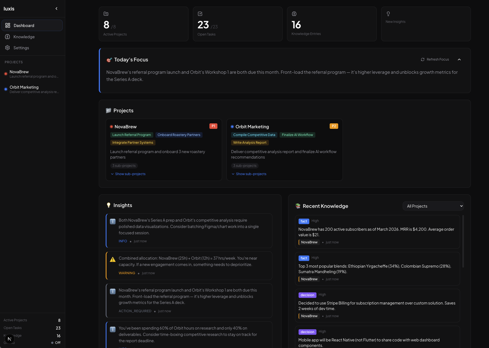

# 🧠 Iuxis — Your AI Chief of Staff

[](https://iuxis.ai)
[](LICENSE)
[](https://github.com/ggospodi/iuxis)

**Local-first AI assistant for solo operators managing multiple concurrent projects.**

No cloud. No subscriptions for core features. Your data never leaves your machine.

🌐 **[iuxis.ai](https://iuxis.ai)** — Learn more, see pricing, get started.



---

## What Is Iuxis?

Iuxis is an AI-powered project management system that runs entirely on your machine. It connects to a local LLM (via Ollama), ingests your project files, and acts as a Chief of Staff — prioritizing your work, surfacing cross-project insights, generating daily briefings, and managing tasks through natural conversation.

Built for founders, indie hackers, freelancers, and anyone juggling 5–15 projects at once.

---

## Quick Start

```bash
git clone https://github.com/ggospodi/iuxis.git
cd iuxis
./start.sh
```

That's it. The start script checks dependencies, starts Ollama, launches the backend and frontend, and opens your browser to `http://localhost:3000`.

On first launch, Iuxis seeds two demo projects so you can explore. When you're ready, type **"Ready to start"** in the chat to clear them and set up your own workspace.

### First-Time Setup (from scratch)

If you're starting from zero — no Ollama, no models — follow these steps before running `./start.sh`:

**1. Install Ollama** (local LLM runtime):
```bash
# macOS
brew install ollama

# Linux
curl -fsSL https://ollama.ai/install.sh | sh

# Windows — download from https://ollama.ai
```

**2. Pull models** (one-time download):
```bash
# Start Ollama
ollama serve &

# Pull the generation model — pick ONE based on your RAM:
ollama pull qwen2.5:32b          # 64 GB RAM — best quality (recommended)
ollama pull qwen2.5:14b          # 32 GB RAM — good quality, faster
ollama pull llama3:8b             # 16 GB RAM — lighter, adequate for testing

# Pull the embedding model (required for knowledge search):
ollama pull nomic-embed-text
```

If you picked a model other than `qwen2.5:32b`, update `config.yaml` after cloning:
```yaml
llm:
  primary_model: "qwen2.5:14b"   # ← match what you pulled
```

**3. Install Python and Node.js** (if not already installed):
```bash
# macOS
brew install python node

# Linux (Ubuntu/Debian)
sudo apt install python3 python3-pip nodejs npm
```

**4. Run Iuxis:**
```bash
git clone https://github.com/ggospodi/iuxis.git
cd iuxis
./start.sh
```

The start script handles `pip install`, `npm install`, and launching all services. First run takes a minute or two for dependency installation — subsequent starts are fast.

### Prerequisites (summary)

- **Python 3.11+**
- **Node.js 18+**
- **Ollama** — [ollama.ai](https://ollama.ai)
- **RAM:** 32 GB minimum, 64 GB recommended
- **Disk:** ~20 GB for models (varies by model size)
- **OS:** macOS, Linux. Windows via WSL2.

### Manual Setup

If you prefer to start services individually instead of using `start.sh`:

```bash
# Terminal 1 — Ollama
ollama serve

# Terminal 2 — Backend
cd iuxis
pip install -r requirements.txt
uvicorn iuxis_api.main:app --reload --port 8000

# Terminal 3 — Frontend
cd iuxis-web
npm install
npm run dev
```

Open `http://localhost:3000`.

---

## How It Works

**1. Create projects** — Tell the chat: *"Create a project called Acme Redesign — it's a product, P1, 20 hours per week."*

**2. Drop files** — Put project documents into `~/iuxis-inbox/` and Iuxis automatically reads, classifies, and routes them to the right project. Meeting notes, specs, reports, checkpoints — anything relevant.

**3. Ask your Chief of Staff** — Chat naturally:

```
"What should I work on today?"
"Generate my morning briefing"
"Create a task for Acme: Review the Q2 roadmap"
"Show tasks for Acme Redesign"
"What's the status across all my projects?"
"Delete the project called Old Experiment"
```

**4. Stay informed** — The dashboard shows Today's Focus, cross-project insights, knowledge entries, and warnings about overallocation or stale work.

---

## Features

### Dashboard
Project cards with priority badges, task counts, and sub-project hierarchy. Stats bar shows active projects, open tasks, and knowledge entries at a glance.

### Today's Focus
AI-generated daily priorities based on deadlines, project allocations, blocked items, and strategic importance. Refreshable on demand.

### Chat Engine
Natural language interface for everything — create projects, manage tasks, ask questions, get briefings. The LLM has full context of your projects, tasks, knowledge base, and recent activity.

### Smart Inbox
Drop files into `~/iuxis-inbox/`. A three-tier routing system handles classification: fuzzy filename matching → LLM content analysis → unassigned queue for ambiguous files.

### Knowledge Base
Every ingested document feeds a searchable knowledge base. Facts, decisions, insights, and context are extracted and linked to projects. Full-text search and vector similarity search included.

### Cross-Project Insights
Iuxis watches for patterns across all your projects — dependency overlaps, capacity warnings, stale work, and strategic recommendations.

### GitHub Integration
Connect your repos via a Personal Access Token. Iuxis pulls commit activity, open issues, and branch state into the knowledge base. Configure in Settings.

### Sub-Projects
Nest projects under parent projects for complex workstreams. Each sub-project has its own tasks, knowledge, and focus.

---

## LLM Setup

Iuxis runs on local models via [Ollama](https://ollama.ai). It's model-agnostic — any Ollama-compatible model works. No API keys required.

### Recommended Models

These are tested and known to work well with Iuxis. The model landscape moves fast — if a better open-source model drops tomorrow, you can swap it in with two commands.

| Model | RAM Required | Quality | Speed | Notes |
|-------|-------------|---------|-------|-------|
| `qwen2.5:32b` | 64 GB | Excellent | Good | Default. Best balance of quality and speed |
| `qwen2.5:14b` | 32 GB | Good | Fast | Best for 32 GB machines |
| `deepseek-r1:32b` | 64 GB | Excellent | Slower | Strong reasoning, verbose output |
| `llama3:70b` | 128 GB | Excellent | Slower | If you have the hardware |
| `llama3:8b` | 16 GB | Adequate | Very fast | Minimum viable for testing |
| `mistral:7b` | 16 GB | Adequate | Very fast | Lightweight alternative |

As larger models become available (70B+, MoE architectures, etc.), Iuxis will run them — there's no model-specific code. If Ollama can serve it, Iuxis can use it.

### Changing Models

Two steps — pull the new model, then update the config:

```bash
# Step 1: Pull the model you want
ollama pull llama3:70b           # or any model from ollama.ai/library

# Step 2: Edit config.yaml — change the model name
```

```yaml
# config.yaml
llm:
  primary_backend: ollama
  ollama:
    base_url: http://127.0.0.1:11434
    model: llama3:70b             # ← Change this to any Ollama model
    embedding_model: nomic-embed-text
```

```bash
# Step 3: Restart the backend (Ctrl+C in Terminal 1, then re-run)
uvicorn iuxis_api.main:app --reload --port 8000
```

You can also ask the chat: *"Help me switch to a different model"* — Iuxis will walk you through it.

**Important:** The `embedding_model` (used for knowledge search) should stay as `nomic-embed-text` unless you have a specific reason to change it. If you do switch embedding models, you'll need to rebuild the vector index since different models produce different-dimensional embeddings.

### Hardware Guidelines

| System RAM | Recommended Model | What to Expect |
|-----------|-------------------|----------------|
| 16 GB | `llama3:8b` or `mistral:7b` | Functional but responses are less nuanced |
| 32 GB | `qwen2.5:14b` | Good quality, responsive. Solid daily driver |
| 64 GB | `qwen2.5:32b` | Excellent quality. The sweet spot for most users |
| 128 GB+ | `llama3:70b` or larger | Best possible quality. Run the biggest model your system supports |

Iuxis offloads all inference to Ollama, so GPU acceleration (Apple Silicon, NVIDIA CUDA) is handled transparently. On Apple Silicon Macs, models run on the unified memory GPU — no separate GPU required.

---

## Adding Projects

### Via Chat

```
"Create a project called Mobile App — product type, P1, 15 hours per week"
"Create a sub-project called API Layer under Mobile App"
```

### Via Inbox

Drop files into `~/iuxis-inbox/`. Iuxis watches this folder and automatically routes files to the right project using a three-tier system:

1. **Filename matching** (instant) — if the file name contains a project name, it routes immediately
2. **LLM content analysis** (slower) — if the filename doesn't match, the LLM reads the file and classifies it
3. **Unassigned queue** — if neither method is confident, the file goes to unassigned for manual review

**Recommended file naming: `projectname-topic-YYYYMMDD.md`**

This gives the best routing accuracy. Examples:

```
~/iuxis-inbox/
  acme-redesign-kickoff-notes-20260401.md      → Routes to "Acme Redesign"
  acme-redesign-sprint-review-20260408.md      → Routes to "Acme Redesign"
  mobile-app-api-spec-20260401.md              → Routes to "Mobile App"
  random-research.md                           → LLM analyzes content, or unassigned
```

Supported file types: `.md`, `.txt`, `.pdf`. Iuxis extracts knowledge (facts, decisions, context) from each file and adds it to the project's knowledge base.

You don't have to follow the naming convention — the LLM can usually figure out where a file belongs from its content. But consistent naming makes routing faster and more reliable.

---

## Project Structure

```
iuxis/
├── iuxis/                  # Core Python package
│   ├── chat_handler.py     # Chat engine + command parsing
│   ├── context_assembler.py # Dynamic LLM context builder
│   ├── llm_client.py       # Ollama integration
│   ├── ingestion_engine.py # File ingestion pipeline
│   ├── knowledge_manager.py # Knowledge base CRUD + search
│   ├── project_manager.py  # Project CRUD
│   ├── task_manager.py     # Task CRUD
│   ├── insight_engine.py   # Cross-project intelligence
│   ├── priority_engine.py  # AI task ranking
│   ├── github_scanner.py   # GitHub activity integration
│   └── premium/            # Premium features (license-gated)
├── iuxis_api/              # FastAPI backend
│   ├── main.py
│   └── routes/             # REST API endpoints
├── iuxis-web/              # Next.js frontend
│   └── src/
├── projects/               # Project data (gitignored)
├── data/                   # SQLite database (gitignored)
├── config.yaml             # Configuration
├── start.sh                # Single-command launcher
└── seed_demo.py            # Demo project seeder
```

---

## Premium

Iuxis is free and open-source for core features. Premium adds compounding intelligence — features that make the system smarter over time and actively coach you:

- **Automated scheduling** — Morning briefings, daily schedules, and insight generation run automatically
- **Process improvement engine** — Weekly retrospectives on your work patterns and time estimation accuracy
- **Work session heartbeat** — Proactive nudges during work hours: deadline alerts, overrun detection, context-switch warnings
- **Time tracking** — Start/stop timers with actual vs. estimated analysis
- **Advanced cross-project analysis** — Deep dependency mapping and portfolio optimization
- **Unlimited projects** — No soft cap, optimized context for 15+ projects

**$29/month or $199/year** — [Get Premium](https://iuxis.ai/#pricing)

| Plan | Price | Link |
|------|-------|------|
| Monthly | $29/month | [Subscribe Monthly](https://iuxis.lemonsqueezy.com/checkout/buy/775c5dea-5783-48ed-b37b-ef6b6d83eb81?enabled=1481876) |
| Annual | $199/year (save 43%) | [Subscribe Annual](https://iuxis.lemonsqueezy.com/checkout/buy/382dbc2d-eef6-42d7-b147-72f828351906?enabled=1481853) |

Premium uses a local license key (`~/.iuxis/license.key`) — no cloud validation, no phone-home. Respects the local-first philosophy.

---

## Configuration

Copy the example config to get started:

```bash
cp config.example.yaml config.yaml
```

Key settings in `config.yaml`:

```yaml
llm:
  primary_backend: ollama
  ollama:
    base_url: http://127.0.0.1:11434
    model: qwen2.5:32b
    embedding_model: nomic-embed-text

paths:
  inbox: ~/iuxis-inbox
  database: data/iuxis.db

ingestion:
  watch_interval: 30        # Seconds between inbox scans
```

---

## Tech Stack

- **Backend:** Python, FastAPI, SQLite, FAISS (vector search)
- **Frontend:** Next.js, TypeScript, Tailwind CSS
- **LLM:** Ollama (local), any compatible model
- **Ingestion:** Custom pipeline with fuzzy matching + LLM classification

---

## Contributing

Contributions are welcome. Please open an issue first to discuss what you'd like to change.

```bash
# Fork and clone
git clone https://github.com/YOUR_USERNAME/iuxis.git
cd iuxis

# Install dev dependencies
pip install -r requirements.txt
cd iuxis-web && npm install

# Run tests
python -m pytest tests/
```

---

## License

MIT — see [LICENSE](LICENSE) for details.

Premium features are source-available under a separate license. See [PREMIUM_LICENSE.md](PREMIUM_LICENSE.md).

---

Built by [Georgi Gospodinov](https://github.com/ggospodi) — a solo operator who needed an AI Chief of Staff and decided to build one.
